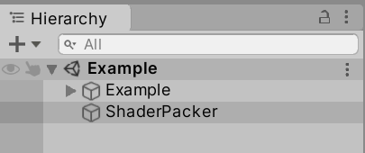
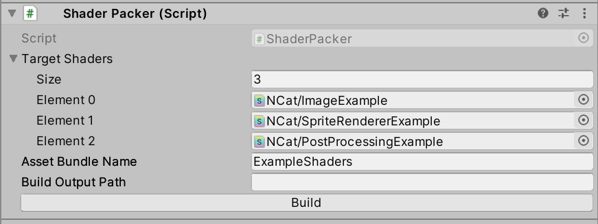

# Unity-Shader-Packer

本项目用于打包指定 Shader 为 AssetBundle

### **如果你要使用于 Arcade-Alpha 请使用 [Unity 2019.3.10f1](https://unity.com/releases/editor/whats-new/2019.3.10#installs) 打开此项目**

# 目录
- [使用教程](#使用教程)
- [Shader 模板](#shader-模板)
- [用于 Arcade-Alpha](#用于-arcade-alpha)

---

# 使用教程

在 `Hierarchy` 中选择 `ShaderPacker` 并查看 `Inspector` 面板 (你也可以选择新建一个 `GameObject` 并添加一个 `ShaderPacker` 脚本)



在 `Inspector` 中找到 `ShaderPacker` 脚本:
- `TargetShaders`: 要打包进 AssetBundle 的 Shader
- `AssetBundleName`: AssetBundle 的名称
- `BuildOutputPath`: AssetBundle 的输出路径

上述参数在 `Inspector` 编辑完毕后点击 `Build` 按钮来构建



---

# Shader 模板

你也可以参考 [Shader 文件夹](./Assets/Shaders) 下的例子

## 目录
- [PostProcessing Shader 模板](#postprocessing-shader-模板)
- [Image Shader 模板](#image-shader-模板)
- [SpriteRenderer Shader 模板](#spriterenderer-shader-模板)
    - [SpriteRenderer.cginc](#spriterenderercginc)

## PostProcessing Shader 模板
<details>
<summary>PostProcessing</summary>

<!--用于 VSCode 的高亮请使用 cpp-->
```shaderlab
// 此处名称不一定按照此格式, 但要保证不会冲突
Shader "Name/ShaderName"
{
  Properties
  {
    _MainTex ("Texture", 2D) = "white" {}
    // 定义 Uniform 在此处会在 Inspector 上 显示
  }
  SubShader
  {
    tags
    {
      "Queue" = "Transparent"
      "RenderType" = "Transparent"
      "IgnoreProjector" = "True"
    }

    Pass
    {
      CGPROGRAM
      #pragma vertex vert
      #pragma fragment frag

      #include "UnityCG.cginc"

      struct appdata
      {
        float4 vertex : POSITION;
        float2 uv : TEXCOORD0;
      };

      struct v2f
      {
        float2 uv : TEXCOORD0;
        float4 vertex : SV_POSITION;
      };

      sampler2D _MainTex;
      float4 _MainTex_ST;
      // 定义你的 Uniform 在此处

      // 顶点着色器
      v2f vert(appdata v)
      {
        v2f o;
        o.vertex = UnityObjectToClipPos(v.vertex);
        o.uv = TRANSFORM_TEX(v.uv, _MainTex);
        return o;
      }

      // 片元着色器
      fixed4 frag(v2f i) : SV_Target
      {
        fixed4 col = tex2D(_MainTex, i.uv);
        return col;
      }
      ENDCG
    }
  }
}
```
</details>

## [Image](https://docs.unity3d.com/Packages/com.unity.ugui@2.0/manual/script-Image.html) Shader 模板
<details>
<summary>Image</summary>

<!--用于 VSCode 的高亮请使用 cpp-->
```shaderlab
// 此处名称不一定按照此格式, 但要保证不会冲突
Shader "Name/ShaderName"
{
  Properties
  {
    _MainTex ("Texture", 2D) = "white" {}
    // 定义 Uniform 在此处会在 Inspector 上 显示
  }
  SubShader
  {
    tags
    {
      "Queue" = "Transparent"
      "RenderType" = "Transparent"
      "IgnoreProjector" = "True"
    }
    
    Cull Off
    ZWrite Off
    Blend One OneMinusSrcAlpha

    Pass
    {
      CGPROGRAM
      #pragma vertex vert
      #pragma fragment frag

      #include "UnityCG.cginc"

      struct appdata
      {
        float4 vertex : POSITION;
        float2 uv : TEXCOORD0;
        float4 color : COLOR;
      };

      struct v2f
      {
        float2 uv : TEXCOORD0;
        float4 vertex : SV_POSITION;
        float4 color : TEXCOORD1;
      };

      sampler2D _MainTex;
      float4 _MainTex_ST;
      // 定义你的 Uniform 在此处

      // 顶点着色器
      v2f vert(appdata v)
      {
        v2f o;
        o.vertex = UnityObjectToClipPos(v.vertex);
        o.uv = TRANSFORM_TEX(v.uv, _MainTex);
        o.color = v.color;
        return o;
      }

      // 片元着色器
      fixed4 frag(v2f i) : SV_Target
      {
        fixed4 col = tex2D(_MainTex, i.uv) * i.color;
        col.rgb *= col.a;
        return col;
      }
      ENDCG
    }
  }
}
```
</details>

## [SpriteRenderer](https://docs.unity3d.com/ScriptReference/SpriteRenderer.html) Shader 模板
<details>
<summary>SpriteRenderer</summary>

<!--用于 VSCode 的高亮请使用 cpp-->
```shaderlab
// 此处名称不一定按照此格式, 但要保证不会冲突
Shader "Name/ShaderName"
{
  Properties
  {
    _MainTex ("Texture", 2D) = "white" {}
    // 定义 Uniform 在此处会在 Inspector 上 显示
  }
  SubShader
  {
    tags
    {
      "Queue" = "Transparent"
      "RenderType" = "Transparent"
      "IgnoreProjector" = "True"
    }
    
    Cull Off
    ZWrite Off
    Blend One OneMinusSrcAlpha

    Pass
    {
      CGPROGRAM
      #pragma vertex vert
      #pragma fragment frag

      #include "UnityCG.cginc"
      #include "SpriteRenderer.cginc"

      struct appdata
      {
        float4 vertex : POSITION;
        float2 uv : TEXCOORD0;
        float4 color : COLOR;
      };

      struct v2f
      {
        float2 uv : TEXCOORD0;
        float4 vertex : SV_POSITION;
        float4 color : TEXCOORD1;
      };

      sampler2D _MainTex;
      float4 _MainTex_ST;
      // 定义你的 Uniform 在此处

      // 顶点着色器
      v2f vert(appdata v)
      {
        v2f o;
        o.vertex = UnityObjectToClipPos(v.vertex);
        o.uv = TRANSFORM_TEX(v.uv, _MainTex);
        o.color = v.color * _RendererColor;
        return o;
      }

      // 片元着色器
      fixed4 frag(v2f i) : SV_Target
      {
        fixed4 col = tex2D(_MainTex, i.uv) * i.color;
        col.rgb *= col.a;
        return col;
      }
      ENDCG
    }
  }
}
```

</details>

## [SpriteRenderer.cginc](./Assets/Shaders/SpriteRenderer.cginc)
<details>
<summary>SpriteRenderer.cginc</summary>

<!--用于 VSCode 的高亮请使用 cpp-->
```shaderlab
#ifndef SPRITE_RENDERER_INCLUDED
#define SPRITE_RENDERER_INCLUDED

#ifdef UNITY_INSTANCING_ENABLED

  UNITY_INSTANCING_BUFFER_START(PerDrawSprite)
    // SpriteRenderer.Color while Non-Batched/Instanced.
    UNITY_DEFINE_INSTANCED_PROP(fixed4, unity_SpriteRendererColorArray)
    // this could be smaller but that's how bit each entry is regardless of type
    UNITY_DEFINE_INSTANCED_PROP(fixed2, unity_SpriteFlipArray)
  UNITY_INSTANCING_BUFFER_END(PerDrawSprite)

  #define _RendererColor  UNITY_ACCESS_INSTANCED_PROP(PerDrawSprite, unity_SpriteRendererColorArray)
  #define _Flip           UNITY_ACCESS_INSTANCED_PROP(PerDrawSprite, unity_SpriteFlipArray)

#endif // instancing

CBUFFER_START(UnityPerDrawSprite)
#ifndef UNITY_INSTANCING_ENABLED
  fixed4 _RendererColor;
  fixed2 _Flip;
#endif
  float _EnableExternalAlpha;
CBUFFER_END

#endif
```
</details>

---

# 用于 Arcade-Alpha

将打包后的 AssetBundle (一般是你给的 AssetBundle 名那个) 放到 `{ProjectFolder}/AssetBundles` 文件夹中

使用自定义脚本 `*.lua` 来使用 Shader (脚本放到 `{ProjectFolder}/Scripts` 文件夹中), Shader 名称是你在 ShaderLab `*.shader` 中开头定义的名称 (例如 `Shader "Name/ShaderName"` 则填 `Name/ShaderName`)

Lua 脚本示例
```lua
-- Post Processing
local postProcessing = ImageEffect.CustomPostProcessing
postProcessing.ApplyShader("Foo/MyShader")
postProcessing.SetUniformFloat("_Progress", 0.5)

-- Image
local image = Component.CreateSprite("MyImage.png", "Foreground");
image.ApplyShader("Foo/MyShader")
image.SetUniformFloat("_Progress", 0.5)

-- SpriteRenderer
local sprite = Component.CreateSprite("MyImage.png", "SkyInput", 100);
sprite.ApplyShader("Foo/MyShader")
sprite.SetUniformFloat("_Progress", 0.5)
```